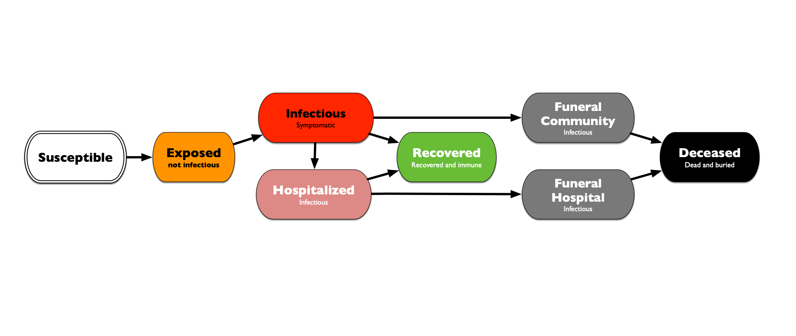

### Ebola Virus Disease model
Susceptible, Exposed, Infectious, Recovered, Hospitalized, Funeral (community and from Hospital) and Deceased
An extension of the classic **Legrand** diseases with addition of symptomatic and asymptomatic Infectious states, where the asymptomatic state can have reduced (or enhanced) infectivity

This model allows for specifying the probability of being hospitalized and dying 

based on: [EpiHiper-Schema/test/003/diseaseModelTemplate2.json] (https://github.com/NSSAC/EpiHiper-Schema/blob/master/test/003/diseaseModelTemplate2.json)
on July 18
