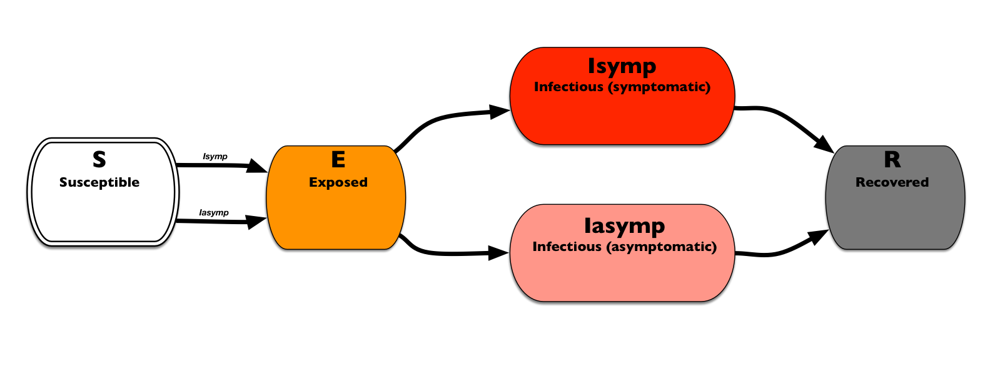

### SEIR model
Susceptible, Exposed, Infectious, and Removed
For classic **SEIR** diseases with addition of symptomatic and asymptomatic Infectious states, where the asymptomatic state can have reduced (or enhanced) infectivity

``` 
S-> E -> Isymp -> R   
      -> Iasymp-> R 
```

This template allows for specifying the overall infectivity and susceptibility as well as the proportion with symptoms and the reduction in infectivity for those without symptoms

Specifically:  
* Susceptibility of susceptible individual  
* Infectivity of Infectious and symptomatic (Isymp)  
* Infectivity of Infectious and asymptomatic (Iasymp)  
* Probability of having symptoms (E to Isymp)  

Classic influenza parameterization:
```
E->Isymp  = 0.67
E->Iasymp = 0.33
  
E dwell time: {0: 0.1, 1: 0.2, 2: 0.6, 3: 0.1}
I dwell time: {3: 0.3, 4: 0.4, 5: 0.2, 6: 0.1}
```
Both `Isymp` ad `Iasymp` can transmit infections. The asymptomatic reduction in infectivity is 60%.

based on: [EpiHiper-Schema/test/003/diseaseModelTemplate1.json](https://github.com/NSSAC/EpiHiper-Schema/blob/master/test/003/diseaseModelTemplate1.json)
on July 17
